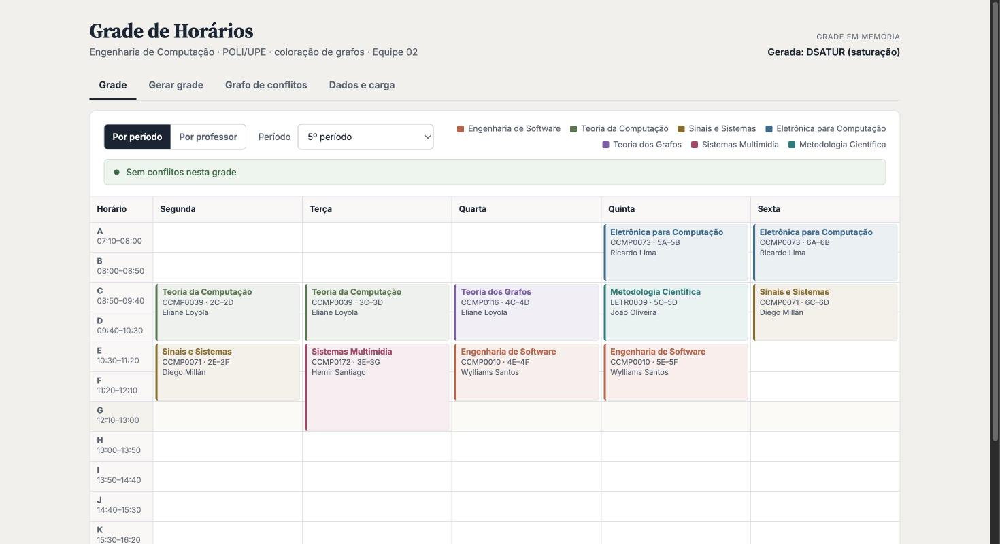
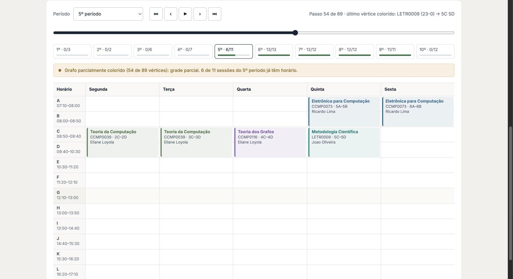

# Projeto de Teoria dos Grafos — Equipe 02

Grade horária do curso de Engenharia de Computação (POLI/UPE) gerada por **coloração de grafos**. Cada aula é um vértice, cada conflito (mesmo professor ou mesmo período) é uma aresta e cada cor é um horário. Uma coloração sem vizinhos da mesma cor é uma grade sem choques.



## Como rodar

Precisa de Python 3.10 ou mais novo.

```bash
cd back-end
python -m venv venv
source venv/bin/activate        # Windows: venv\Scripts\Activate.ps1
pip install -r requirements.txt
uvicorn main:app --reload
```

Abra http://localhost:8000. Na primeira execução, a carga de dados roda sozinha e cria o banco SQLite local. A documentação da API fica em http://localhost:8000/docs.

Testes: `python -m pytest testes -v`, de dentro de `back-end` (66 testes).

## O que o sistema faz

| Tela | O que mostra |
|---|---|
| **Grade** | Grade por período ou por professor, nos três estados do protótipo (sem conflito, com conflito, vazio). Arrastar uma aula para outra faixa muda a cor do vértice no grafo e recalcula os conflitos. |
| **Gerar grade** | Gera a grade com DSATUR ou com a busca gulosa e mostra a coloração passo a passo: grafo sem cor = grade vazia, parcialmente colorido = grade parcial, todo colorido = grade completa. Salva e carrega grades do banco. |
| **Grafo de conflitos** | O subgrafo de um período ou de um professor, com as cores (blocos de horário) e as arestas por motivo. Exporta o grafo em JSON. |
| **Dados e carga** | Relatório da carga (linhas ignoradas, horários modificados, divergências com o CP21) e a tabela de disciplinas. |



## Documentação

- [Modelo de dados](docs/modelo-de-dados.md): conceitual, lógico e físico, com as correções da professora.
- [Modelagem em grafos](back-end/graphs/MODELAGEM.md): vértices, arestas, cores, algoritmos e resultados.
- [Relatório da carga](back-end/database/data/relatorio_carga.md): o que foi carregado e o que foi ignorado.
- [Back-end](back-end/README.md): arquivos e comandos.
- [Relatório da entrega das Iterações 03, 04 e 06](docs/RELATORIO_ENTREGA.md).

## Estrutura

```
back-end/
  main.py                 API (FastAPI) e servidor do front-end
  database/               schema.sql, carga de dados, repositório (SQLite/Supabase), fontes
  graphs/                 grafo de conflitos, coloração (DSATUR), agendamento, grade em memória
  testes/                 pytest
front-end/                telas em HTML, CSS e JavaScript (servidas pela API)
docs/                     modelo de dados, relatório e imagens
```

## Equipe

Daniel Lourenzano, Daniel Medeiros Pessoa, Dyhego Alexandre, Edward Lira, Gabriel Esteves, Giovanna Lima, João Guilherme e Letícia Fontenelle. Gerente de produto: Prof.ª Eliane Loiola.

Backlog: [Trello](https://trello.com/b/5ANDrLCH/projeto-teoria-dos-grafos) · Protótipo: [Figma](https://www.figma.com/design/8nSzcQoU79RKINqvHHM9TP/Teoria-dos-Grafos---Equipe-2)
