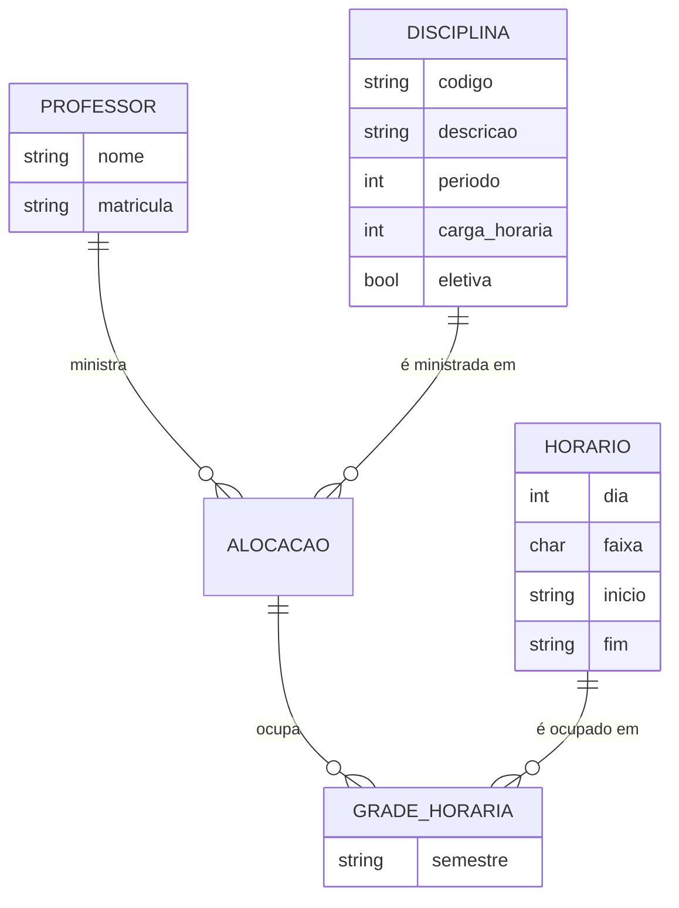
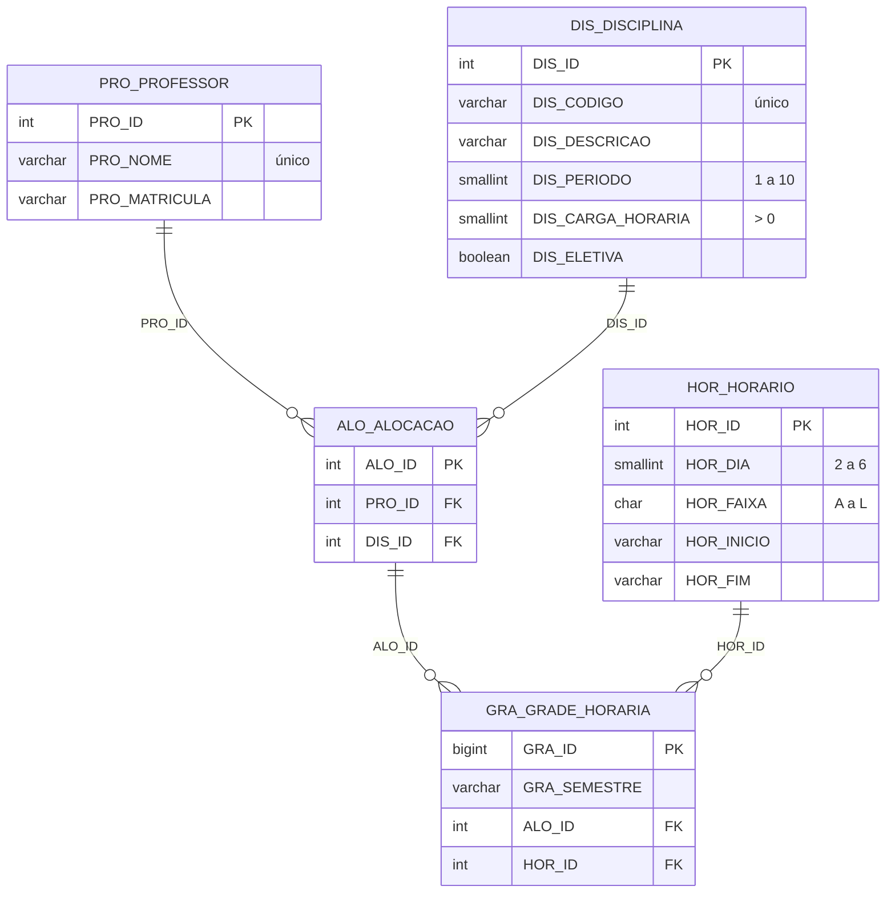

# Modelo de dados

Item 4 do backlog (Iteração 03). Este documento traz as três visões pedidas
pela professora (conceitual, lógica e física) já com as correções apontadas no
card **Modelo de Dados** do Trello e na devolutiva de 20/09.

## Correções aplicadas

| Problema apontado | Como ficou |
|---|---|
| Faltou anexar a entrega (modelo ou link) | Este documento e o `schema.sql` estão no repositório e linkados no card. |
| Nomenclatura dos objetos ruim (exemplo: `PRO_PROFESSOR` com `PRO_ID`, `PRO_NOME`, `PRO_MATRICULA`) | Toda tabela é `SIGLA_ENTIDADE` e toda coluna é `SIGLA_ATRIBUTO`. |
| Erro conceitual: o modelo deve ter PROFESSOR (ID, NOME, MATRÍCULA), DISCIPLINA (ID, CÓDIGO, DESCRIÇÃO, PERÍODO), ALOCAÇÃO (PROFESSOR x DISCIPLINA) e GRADE HORÁRIA (ID, SEMESTRE, PROFESSOR, DISCIPLINA, HORÁRIO) | São exatamente as entidades do modelo, mais `HOR_HORARIO`, que é a "cor" do grafo. A grade referencia professor e disciplina pela alocação. |
| Padronizar o nome dos objetos com siglas de **3 letras** | As tabelas antigas `DI_DISCIPLINA` e `HO_HORARIO` (2 letras) viraram `DIS_DISCIPLINA` e `HOR_HORARIO`. |

Atributos acrescentados para atender a Iteração 04 (US-01) e a Iteração 06 (US-03):

- `DIS_CARGA_HORARIA`: cada disciplina recebe carga / 15 faixas por semana.
- `DIS_ELETIVA`: eletivas do mesmo período podem coincidir entre si (ver `back-end/graphs/MODELAGEM.md`).
- `HOR_DIA`/`HOR_FAIXA`: o horário segue o padrão da POLI usado no GradeProfessor.pdf (dia 2 a 6 + faixa A a L; ex.: `2C` = segunda, 08:50).

## 1. Modelo conceitual



- Um **professor** ministra várias disciplinas e uma **disciplina** pode ter mais de um professor (ex.: turmas diferentes). A **alocação** é essa relação professor x disciplina.
- A **grade horária** de um semestre diz, para cada alocação, quais **horários** (faixas) ela ocupa.
- O **grafo de conflitos** não é guardado no banco: ele é montado a partir das alocações (vértices) e das regras de conflito (arestas). A coloração do grafo é que gera as linhas da grade.

## 2. Modelo lógico



| Tabela | Chave primária | Chaves estrangeiras | Unicidade |
|---|---|---|---|
| `PRO_PROFESSOR` | `PRO_ID` | – | `PRO_NOME` |
| `DIS_DISCIPLINA` | `DIS_ID` | – | `DIS_CODIGO` |
| `HOR_HORARIO` | `HOR_ID` | – | (`HOR_DIA`, `HOR_FAIXA`) |
| `ALO_ALOCACAO` | `ALO_ID` | `PRO_ID` → `PRO_PROFESSOR`, `DIS_ID` → `DIS_DISCIPLINA` | (`PRO_ID`, `DIS_ID`) |
| `GRA_GRADE_HORARIA` | `GRA_ID` | `ALO_ID` → `ALO_ALOCACAO`, `HOR_ID` → `HOR_HORARIO` | (`GRA_SEMESTRE`, `ALO_ID`, `HOR_ID`) |

Os `HOR_ID` vão de 1 (segunda, faixa A, 07:10) a 60 (sexta, faixa L, 16:20), na ordem dia e depois faixa.

## 3. Modelo físico

O DDL está em [`back-end/database/schema.sql`](../back-end/database/schema.sql). O mesmo arquivo cria o banco no **PostgreSQL do Supabase** e no **SQLite local** (usado por padrão enquanto o projeto do Supabase está pausado).

Para o Supabase, que ainda tem as tabelas antigas (`DI_`/`HO_`), rode [`migracao_supabase.sql`](../back-end/database/migracao_supabase.sql) e depois `schema.sql` no SQL Editor, e em seguida a carga:

```bash
cd back-end
python -m database.data_ingestion.data_ingestion --banco supabase
```

## Carga de dados

A carga (`back-end/database/data_ingestion/data_ingestion.py`) lê as fontes extraídas dos materiais da Iteração 02 e preenche as cinco tabelas:

| Tabela | Linhas | Origem |
|---|---|---|
| `PRO_PROFESSOR` | 26 | GradeProfessor.pdf |
| `DIS_DISCIPLINA` | 48 | GradeProfessor.pdf (código, nome, período, eletiva) + CP21 (carga horária) |
| `HOR_HORARIO` | 60 | padrão de faixas da POLI (A a L, segunda a sexta) |
| `ALO_ALOCACAO` | 48 | GradeProfessor.pdf (professor x disciplina) |
| `GRA_GRADE_HORARIA` | 181 | horários **atuais** do GradeProfessor.pdf, semestre `2026.2` |

O relatório de linhas ignoradas, horários modificados e divergências com o CP21 é gerado em [`back-end/database/data/relatorio_carga.md`](../back-end/database/data/relatorio_carga.md).
